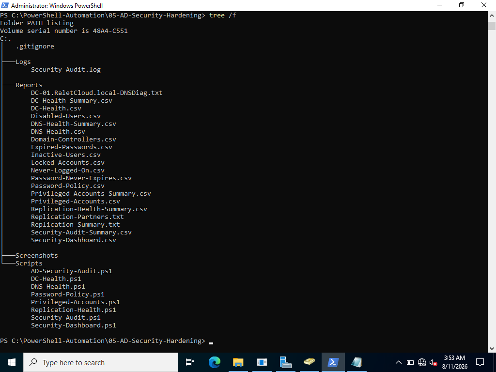
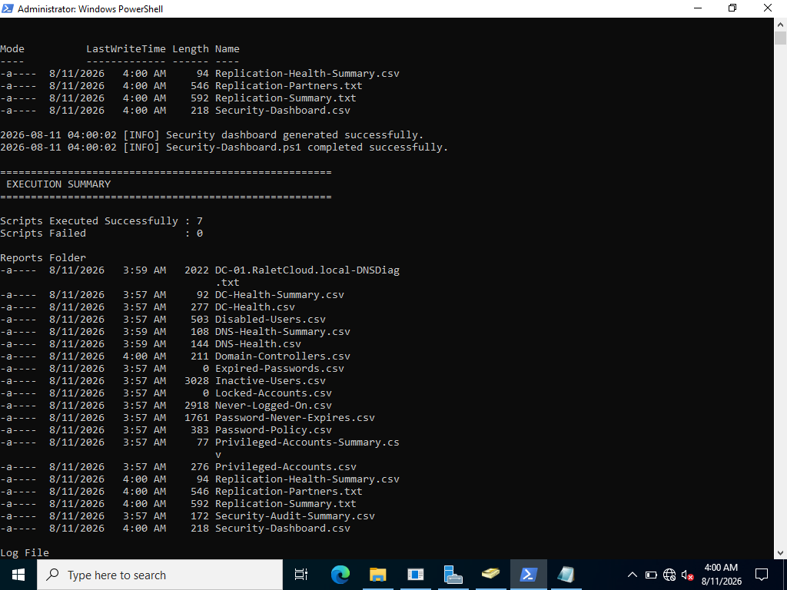
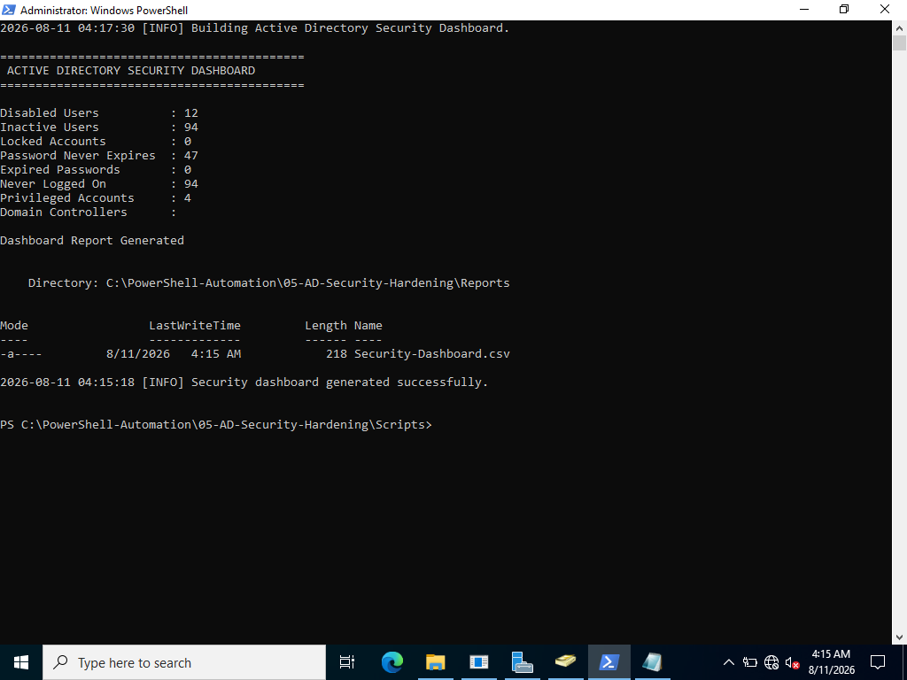
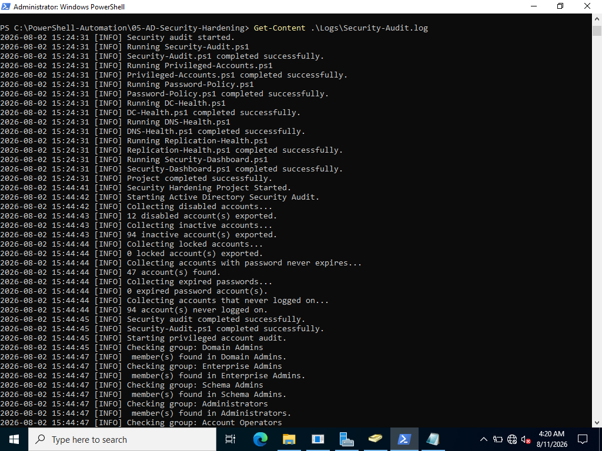

# powershell-ad-security-hardening
PowerShell-based Active Directory security auditing, hardening, and infrastructure health monitoring.
# Active Directory Security Hardening with PowerShell

## Project Overview

This project demonstrates how to automate Active Directory security auditing and infrastructure health checks using PowerShell in a Windows Server environment.

The scripts audit user security, privileged accounts, password policies, Domain Controller health, DNS, and Active Directory replication.

---

## Project Objectives

This project automates:

* User Security Auditing
* Privileged Account Auditing
* Password Policy Auditing
* Domain Controller Health Checks
* DNS Health Checks
* Replication Monitoring
* Security Dashboard
* Audit Logging

---

## Technologies Used

* Windows Server 2022
* Active Directory Domain Services
* Windows PowerShell 5.1
* Active Directory PowerShell Module
* DNS
* `dcdiag`
* `repadmin`
* CSV Reporting

---

## Project Structure

```text
05-AD-Security-Hardening
│
├── Scripts
│   ├── AD-Security-Audit.ps1
│   ├── Security-Audit.ps1
│   ├── Privileged-Accounts.ps1
│   ├── Password-Policy.ps1
│   ├── DC-Health.ps1
│   ├── DNS-Health.ps1
│   ├── Replication-Health.ps1
│   └── Security-Dashboard.ps1
│
├── Reports
├── Logs
├── Screenshots
└── README.md
```

---

## Security Checks

| Script                  | Purpose                         |
| ----------------------- | ------------------------------- |
| Security-Audit.ps1      | Audits user security            |
| Privileged-Accounts.ps1 | Reviews privileged groups       |
| Password-Policy.ps1     | Audits password settings        |
| DC-Health.ps1           | Checks Domain Controller health |
| DNS-Health.ps1          | Checks DNS health               |
| Replication-Health.ps1  | Checks AD replication           |
| Security-Dashboard.ps1  | Generates security summary      |

---

## How to Run

Open PowerShell as Administrator.

```powershell
cd C:\PowerShell-Automation\05-AD-Security-Hardening\Scripts
```

Run the master script:

```powershell
.\AD-Security-Audit.ps1
```

Reports are generated in the `Reports` folder, and execution activity is recorded in the `Logs` folder.

---

## Project Evidence

### 1. Project Structure



### 2. Security Audit Execution



### 3. Security Dashboard



### 4. PowerShell Verification



---

## Skills Demonstrated

* Active Directory Administration
* PowerShell Automation
* Security Auditing
* Privileged Access Management
* Password Policy Management
* Domain Controller Monitoring
* DNS & Replication Monitoring
* Infrastructure Reporting

---

## Author

**Michael Okwuora**

Systems & IT Support Engineer | Windows Server | Active Directory | PowerShell | Microsoft 365 | IT Infrastructure

---

## License

This project is provided for educational and portfolio purposes.
